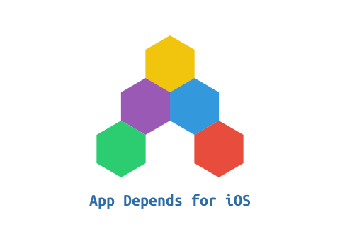

#

	
	
本仓库旨在搜集热门APP，列举其所依赖和使用的开源库。可供大家在开发iOS应用时参考，了解业内开发技术趋势和流行技术框架。

	
更多 iOS 开源精选： <a href="https://awehunt.com/?tnid=5af1c0bb7b4fac67bf3af2b5">Awehunt - iOS</a>
	

	 

# 内容
- [工具](#工具)
	- [Bitmoji](#bitmoji)
	- [QQ邮箱](#qq邮箱)
	- [WiFi钥匙](#wifi钥匙)
	- [百度](#百度)
- [社交](#社交)
	- [Messenger](#messenger)
	- [Facebook](#facebook)
	- [WhatsApp Messenger](#whatsapp-messenger)
	- [Pinterest](#pinterest)
	- [微信](#微信)
	- [微博](#微博)
	- [Weibo intl.](#weibo-intl)
	- [QQ](#qq)
	- [QQ International](#qq-international)
- [摄影与录像](#摄影与录像)
	- [Snapchat](#snapchat)
	- [YouTube](#youtube)
	- [Instagram](#instagram)
	- [抖音](#抖音)
- [游戏](#游戏)
	- [Baseball Boy!](#baseball-boy)
	- [Rules of Survival](#rules-of-survival)
	- [Knife Hit](#knife-hit)
	- [Splashy!](#splashy)
	- [FLO Game](#flo-game)
- [导航](#导航)
	- [Google Maps](#google-maps)
- [效率](#效率)
	- [Gmail](#gmail)
	- [Google Docs](#google-docs)
- [财务](#财务)
	- [IRS2Go](#irs2go)
- [娱乐](#娱乐)
	- [Netflix](#netflix)
- [音乐](#音乐)
	- [Spotify Music](#spotify-music)
	- [Pandora Music](#pandora-music)
	- [QQ音乐](#qq音乐)
- [旅游](#旅游)
	- [Uber](#uber)
	- [滴滴](#滴滴)
- [购物](#购物)
	- [Wish](#wish)
	- [Amazon](#amazon)
	- [拼多多](#拼多多)
	- [淘宝](#淘宝)
	- [天猫](#天猫)
	- [京东](#京东)
- [新闻](#新闻)
	- [Twitter](#twitter)
- [商务](#商务)
	- [企业微信](#企业微信)
- [生活](#生活)
	- [支付宝](#支付宝)
	- [美团](#美团)
	- [大众点评](#大众点评)
- [图书](#图书)
	- [微信读书](#微信读书)

## 工具
### [Bitmoji](https://itunes.apple.com/us/app/id868077558)
- [AFNetworking](https://github.com/AFNetworking/AFNetworking)  网络
- [Alamofire](https://github.com/Alamofire/Alamofire)  网络
- [Answers](https://answers.io/)  分析
- [Appirater](https://github.com/arashpayan/appirater)  工具
- [Crashlytics](http://try.crashlytics.com/)  崩溃报告
- [Fabric by Twitter](https://get.fabric.io/)  框架
- [Hero](https://github.com/HeroTransitions/Hero)  界面
- [MBProgressHUD](https://github.com/matej/MBProgressHUD)  界面
- [Masonry](https://github.com/SnapKit/Masonry)  界面
- [PINCache](https://github.com/pinterest/PINCache)  数据库
- [PINRemoteImage](https://github.com/pinterest/PINRemoteImage)  网络

### [QQ邮箱](https://itunes.apple.com/cn/app/id473225145)
- [AFNetworking](https://github.com/AFNetworking/AFNetworking)  网络
- [ASIHTTPRequest](https://github.com/pokeb/asi-http-request)  网络
- [CocoaAsyncSocket](https://github.com/robbiehanson/CocoaAsyncSocket)  网络
- [CocoaLumberjack](https://github.com/CocoaLumberjack/CocoaLumberjack)  基础架构
- [FMDB](https://github.com/ccgus/fmdb)  数据库
- [MBProgressHUD](https://github.com/matej/MBProgressHUD)  界面
- [Masonry](https://github.com/SnapKit/Masonry)  界面
- [OpenCV](https://github.com/Itseez/opencv)  图形与视频
- [PLCrashReporter](https://github.com/plausiblelabs/plcrashreporter)  崩溃报告
- [RBBAnimaion](https://github.com/robb/RBBAnimation)  界面
- [ReactiveCocoa](https://github.com/ReactiveCocoa/ReactiveCocoa)  工具
- [SDWebImage](https://github.com/rs/SDWebImage)  界面
- [SSKeychain](https://github.com/soffes/SSKeychain)  工具
- [SZTextView](https://github.com/glaszig/SZTextView)  界面

### [WiFi钥匙](https://itunes.apple.com/cn/app/id887171753)
- [AFNetworking](https://github.com/AFNetworking/AFNetworking)  网络
- [Baidu Maps](http://lbsyun.baidu.com/index.php?title=iossdk)  地图
- [DACircularProgress](https://github.com/danielamitay/DACircularProgress)  界面
- [DXPopover](https://github.com/xiekw2010/DXPopover)  界面
- [FHSegmentedViewController](https://github.com/iDay/FHSegmentedViewController)  界面
- [FLAnimatedImage](https://github.com/Flipboard/FLAnimatedImage)  界面
- [FMDB](https://github.com/ccgus/fmdb)  数据库
- [IQKeyboardManager](https://github.com/hackiftekhar/IQKeyboardManager)  界面
- [MBProgressHUD](https://github.com/matej/MBProgressHUD)  界面
- [MJRefresh](https://github.com/CoderMJLee/MJRefresh)  界面
- [MWPhotoBrowser](https://github.com/mwaterfall/MWPhotoBrowser)  界面
- [Masonry](https://github.com/SnapKit/Masonry)  界面
- [SAMKeychain](https://github.com/soffes/samkeychain)
- [SDWebImage](https://github.com/rs/SDWebImage)  界面
- [SQL Cipher](https://github.com/sqlcipher/sqlcipher.git)  数据库
- [SVProgressHUD](https://github.com/SVProgressHUD/SVProgressHUD)  界面
- [Shimmer](https://github.com/facebook/Shimmer)  界面
- [TTTAttributedLabel](https://github.com/TTTAttributedLabel/TTTAttributedLabel)  界面
- [YYKit](https://github.com/ibireme/YYKit)  工具

### [百度](https://itunes.apple.com/cn/app/id382201985)
- [AESCrypt](https://github.com/PodRepo/AESCrypt)  工具
- [AFNetworking](https://github.com/AFNetworking/AFNetworking)  网络
- [ASIHTTPRequest](https://github.com/pokeb/asi-http-request)  网络
- [Alipay](https://github.com/candyan/AlipaySDK)  支付
- [Baidu Maps](http://lbsyun.baidu.com/index.php?title=iossdk)  地图
- [CocoaLumberjack](https://github.com/CocoaLumberjack/CocoaLumberjack)  基础架构
- [DACircularProgress](https://github.com/danielamitay/DACircularProgress)  界面
- [DeviceUtil](https://github.com/InderKumarRathore/DeviceUtil)  工具
- [FLAnimatedImage](https://github.com/Flipboard/FLAnimatedImage)  界面
- [FMDB](https://github.com/ccgus/fmdb)  数据库
- [FXBlurView](https://github.com/nicklockwood/FXBlurView)  界面
- [GBDeviceInfo](https://github.com/lmirosevic/GBDeviceInfo)  工具
- [GPUImage](https://github.com/BradLarson/GPUImage)  图形与视频
- [HPGrowingTextView](https://github.com/HansPinckaers/GrowingTextView)  界面
- [JazzHands](https://github.com/IFTTT/JazzHands)  界面
- [MBProgressHUD](https://github.com/matej/MBProgressHUD)  界面
- [MJRefresh](https://github.com/CoderMJLee/MJRefresh)  界面
- [MWPhotoBrowser](https://github.com/mwaterfall/MWPhotoBrowser)  界面
- [MagicalRecord](https://github.com/magicalpanda/MagicalRecord)  工具
- [Masonry](https://github.com/SnapKit/Masonry)  界面
- [OpenUDID](https://github.com/ylechelle/OpenUDID)  工具
- [PLCrashReporter](https://github.com/plausiblelabs/plcrashreporter)  崩溃报告
- [Pop](https://github.com/facebook/pop)  界面
- [RBBAnimaion](https://github.com/robb/RBBAnimation)  界面
- [React Native](https://github.com/facebook/react-native)  框架
- [SDWebImage](https://github.com/rs/SDWebImage)  界面
- [SMPageControl](https://github.com/Spaceman-Labs/SMPageControl)  界面
- [SSZipArchive](https://github.com/ZipArchive/ZipArchive)  工具
- [TTTAttributedLabel](https://github.com/TTTAttributedLabel/TTTAttributedLabel)  界面
- [XXNibBridge](https://github.com/sunnyxx/XXNibBridge)
- [YYKit](https://github.com/ibireme/YYKit)  工具
- [iCarousel](https://github.com/nicklockwood/iCarousel)  界面

## 社交
### [Messenger](https://itunes.apple.com/us/app/id454638411)
- [Apache Thrift](https://thrift.apache.org/)  框架
- [AsyncDisplayKit](https://github.com/facebookarchive/AsyncDisplayKit)  界面
- [Bolts-ObjC](https://github.com/BoltsFramework/Bolts-ObjC)  工具
- [CocoaAsyncSocket](https://github.com/robbiehanson/CocoaAsyncSocket)  网络
- [CocoaLumberjack](https://github.com/CocoaLumberjack/CocoaLumberjack)  基础架构
- [EGODatabase](https://github.com/enormego/egodatabase)  数据库
- [FBAllocationTracker](https://github.com/facebook/FBAllocationTracker)
- [FLAnimatedImage](https://github.com/Flipboard/FLAnimatedImage)  界面
- [KVOController](https://github.com/facebook/KVOController)  工具
- [Pop](https://github.com/facebook/pop)  界面
- [SSZipArchive](https://github.com/ZipArchive/ZipArchive)  工具
- [Shimmer](https://github.com/facebook/Shimmer)  界面
- [ZipZap](https://github.com/pixelglow/ZipZap)  工具
- [libPhoneNumber](https://github.com/iziz/libPhoneNumber-iOS)  工具

### [Facebook](https://itunes.apple.com/us/app/id284882215)
- [Apache Thrift](https://thrift.apache.org/)  框架
- [AsyncDisplayKit](https://github.com/facebookarchive/AsyncDisplayKit)  界面
- [Bolts-ObjC](https://github.com/BoltsFramework/Bolts-ObjC)  工具
- [Card.IO](https://github.com/card-io/card.io-iOS-SDK)  支付
- [CocoaAsyncSocket](https://github.com/robbiehanson/CocoaAsyncSocket)  网络
- [CocoaLumberjack](https://github.com/CocoaLumberjack/CocoaLumberjack)  基础架构
- [EGODatabase](https://github.com/enormego/egodatabase)  数据库
- [FLAnimatedImage](https://github.com/Flipboard/FLAnimatedImage)  界面
- [FXBlurView](https://github.com/nicklockwood/FXBlurView)  界面
- [Fabric by Twitter](https://get.fabric.io/)  框架
- [KVOController](https://github.com/facebook/KVOController)  工具
- [OpenCV](https://github.com/Itseez/opencv)  图形与视频
- [Pop](https://github.com/facebook/pop)  界面
- [React Native](https://github.com/facebook/react-native)  框架
- [SSZipArchive](https://github.com/ZipArchive/ZipArchive)  工具
- [Shimmer](https://github.com/facebook/Shimmer)  界面
- [SocketRocket](https://github.com/facebook/SocketRocket)  网络
- [Stripe](https://github.com/stripe/stripe-ios)  支付
- [YogaKit](https://github.com/facebook/yoga)  界面
- [ZipZap](https://github.com/pixelglow/ZipZap)  工具
- [libPhoneNumber](https://github.com/iziz/libPhoneNumber-iOS)  工具

### [WhatsApp Messenger](https://itunes.apple.com/us/app/id310633997)
- [APNumberPad](https://github.com/podkovyrin/APNumberPad)  界面
- [CocoaAsyncSocket](https://github.com/robbiehanson/CocoaAsyncSocket)  网络
- [FMDB](https://github.com/ccgus/fmdb)  数据库
- [MBProgressHUD](https://github.com/matej/MBProgressHUD)  界面
- [Pop](https://github.com/facebook/pop)  界面
- [Protobuf](https://github.com/google/protobuf)  网络
- [SSZipArchive](https://github.com/ZipArchive/ZipArchive)  工具
- [XMPPFramework](https://github.com/robbiehanson/XMPPFramework)  通信

### [Pinterest](https://itunes.apple.com/us/app/id429047995)
- [1Password](https://github.com/AgileBits/onepassword-app-extension)  认证
- [AdMob](https://www.google.com/admob/)  广告
- [Adjust](https://github.com/adjust/ios_sdk)  归因
- [Answers](https://answers.io/)  分析
- [Apache Thrift](https://thrift.apache.org/)  框架
- [AsyncDisplayKit](https://github.com/facebookarchive/AsyncDisplayKit)  界面
- [Bolts-ObjC](https://github.com/BoltsFramework/Bolts-ObjC)  工具
- [Braintree (Paypal)](https://developers.braintreepayments.com/)  支付
- [Branch Metrics](https://github.com/BranchMetrics/ios-branch-deep-linking)  归因
- [CocoaLumberjack](https://github.com/CocoaLumberjack/CocoaLumberjack)  基础架构
- [Crashlytics](http://try.crashlytics.com/)  崩溃报告
- [FMDB](https://github.com/ccgus/fmdb)  数据库
- [Fabric by Twitter](https://get.fabric.io/)  框架
- [Facebook Mobile SDKs](https://github.com/facebook/facebook-ios-sdk)  框架
- [Google Firebase](https://firebase.google.com/)  框架
- [GoogleNetworkingUtilities](https://cocoapods.org/pods/GoogleNetworkingUtilities)  网络
- [KVOController](https://github.com/facebook/KVOController)  工具
- [Masonry](https://github.com/SnapKit/Masonry)  界面
- [PINCache](https://github.com/pinterest/PINCache)  数据库
- [PINRemoteImage](https://github.com/pinterest/PINRemoteImage)  网络
- [Pop](https://github.com/facebook/pop)  界面
- [React Native](https://github.com/facebook/react-native)  框架
- [Stripe](https://github.com/stripe/stripe-ios)  支付

### [微信](https://itunes.apple.com/cn/app/id414478124)
- [Facebook Mobile SDKs](https://github.com/facebook/facebook-ios-sdk)  框架
- [GPUImage](https://github.com/BradLarson/GPUImage)  图形与视频
- [KSCrash](https://github.com/kstenerud/KSCrash)  崩溃报告
- [OpenUDID](https://github.com/ylechelle/OpenUDID)  工具
- [Pop](https://github.com/facebook/pop)  界面
- [SocketRocket](https://github.com/facebook/SocketRocket)  网络
- [YYKit](https://github.com/ibireme/YYKit)  工具

### [微博](https://itunes.apple.com/cn/app/id350962117)
- [ABContactHelper](https://github.com/erica/ABContactHelper)  工具
- [AESCrypt](https://github.com/PodRepo/AESCrypt)  工具
- [AFNetworking](https://github.com/AFNetworking/AFNetworking)  网络
- [Answers](https://answers.io/)  分析
- [CocoaAsyncSocket](https://github.com/robbiehanson/CocoaAsyncSocket)  网络
- [Crashlytics](http://try.crashlytics.com/)  崩溃报告
- [DACircularProgress](https://github.com/danielamitay/DACircularProgress)  界面
- [Fabric by Twitter](https://get.fabric.io/)  框架
- [Flurry](https://github.com/flurry/flurry-ios-sdk)  分析
- [GBDeviceInfo](https://github.com/lmirosevic/GBDeviceInfo)  工具
- [GPUImage](https://github.com/BradLarson/GPUImage)  图形与视频
- [HPGrowingTextView](https://github.com/HansPinckaers/GrowingTextView)  界面
- [Masonry](https://github.com/SnapKit/Masonry)  界面
- [ONE by AOL: Mobile (Millennial Media)](https://docs.onemobilesdk.aol.com/ios-ad-sdk/)  广告
- [RegexKitLite](https://cocoapods.org/pods/RegexKitLite)  工具
- [SSZipArchive](https://github.com/ZipArchive/ZipArchive)  工具
- [SocketRocket](https://github.com/facebook/SocketRocket)  网络
- [TFHpple](https://github.com/tpctt/TFHpple)  工具
- [TTTAttributedLabel](https://github.com/TTTAttributedLabel/TTTAttributedLabel)  界面
- [V8HorizontalPickerView](https://github.com/veader/V8HorizontalPickerView)  界面
- [YYKit](https://github.com/ibireme/YYKit)  工具

### [Weibo intl.](https://itunes.apple.com/us/app/id1215210046)
- [1Password](https://github.com/AgileBits/onepassword-app-extension)  认证
- [AFNetworking](https://github.com/AFNetworking/AFNetworking)  网络
- [Answers](https://answers.io/)  分析
- [AsyncDisplayKit](https://github.com/facebookarchive/AsyncDisplayKit)  界面
- [Bolts-ObjC](https://github.com/BoltsFramework/Bolts-ObjC)  工具
- [Crashlytics](http://try.crashlytics.com/)  崩溃报告
- [DateTools](https://github.com/MatthewYork/DateTools)  工具
- [FLAnimatedImage](https://github.com/Flipboard/FLAnimatedImage)  界面
- [FMDB](https://github.com/ccgus/fmdb)  数据库
- [Fabric by Twitter](https://get.fabric.io/)  框架
- [Facebook Mobile SDKs](https://github.com/facebook/facebook-ios-sdk)  框架
- [Flurry](https://github.com/flurry/flurry-ios-sdk)  分析
- [Google Firebase](https://firebase.google.com/)  框架
- [MBProgressHUD](https://github.com/matej/MBProgressHUD)  界面
- [MagicalRecord](https://github.com/magicalpanda/MagicalRecord)  工具
- [Mantle](https://github.com/Mantle/Mantle)  工具
- [Masonry](https://github.com/SnapKit/Masonry)  界面
- [OMG HTTP URL RQ](https://github.com/mxcl/OMGHTTPURLRQ)  网络
- [OpenUDID](https://github.com/ylechelle/OpenUDID)  工具
- [PINCache](https://github.com/pinterest/PINCache)  数据库
- [PINRemoteImage](https://github.com/pinterest/PINRemoteImage)  网络
- [Pop](https://github.com/facebook/pop)  界面
- [Promise Kit](https://github.com/mxcl/PromiseKit)
- [SSZipArchive](https://github.com/ZipArchive/ZipArchive)  工具
- [SVProgressHUD](https://github.com/SVProgressHUD/SVProgressHUD)  界面
- [SpinKit](https://github.com/raymondjavaxx/SpinKit-ObjC)  界面
- [TTTAttributedLabel](https://github.com/TTTAttributedLabel/TTTAttributedLabel)  界面
- [Twitter](https://github.com/twitter/twitter-kit-ios)  社交
- [UICKeyChainStore](https://github.com/kishikawakatsumi/UICKeyChainStore)  工具
- [YYKit](https://github.com/ibireme/YYKit)  工具
- [ZBarSDK](https://github.com/ZBar/ZBar.git)  工具
- [iRate](https://github.com/nicklockwood/iRate)  工具

### [QQ](https://itunes.apple.com/cn/app/id444934666)
- [AFNetworking](https://github.com/AFNetworking/AFNetworking)  网络
- [AVOSCloud](https://github.com/leancloud/objc-sdk)  框架
- [CocoaAsyncSocket](https://github.com/robbiehanson/CocoaAsyncSocket)  网络
- [FMDB](https://github.com/ccgus/fmdb)  数据库
- [GPUImage](https://github.com/BradLarson/GPUImage)  图形与视频
- [HPGrowingTextView](https://github.com/HansPinckaers/GrowingTextView)  界面
- [KSCrash](https://github.com/kstenerud/KSCrash)  崩溃报告
- [KVOController](https://github.com/facebook/KVOController)  工具
- [MBProgressHUD](https://github.com/matej/MBProgressHUD)  界面
- [RegexKitLite](https://cocoapods.org/pods/RegexKitLite)  工具
- [SDWebImage](https://github.com/rs/SDWebImage)  界面
- [YYKit](https://github.com/ibireme/YYKit)  工具
- [iCarousel](https://github.com/nicklockwood/iCarousel)  界面

### [QQ International](https://itunes.apple.com/us/app/id710380093)
- [ASIHTTPRequest](https://github.com/pokeb/asi-http-request)  网络
- [DACircularProgress](https://github.com/danielamitay/DACircularProgress)  界面
- [EGOTableViewPullRefresh](https://github.com/enormego/EGOTableViewPullRefresh)  界面
- [FMDB](https://github.com/ccgus/fmdb)  数据库
- [GPUImage](https://github.com/BradLarson/GPUImage)  图形与视频
- [GTMOAuth2](https://github.com/google/gtm-oauth2)  认证
- [MBProgressHUD](https://github.com/matej/MBProgressHUD)  界面
- [MSCMoreOptionTableViewCell](https://github.com/scheinem/MSCMoreOptionTableViewCell)  界面
- [RegexKitLite](https://cocoapods.org/pods/RegexKitLite)  工具

## 摄影与录像
### [Snapchat](https://itunes.apple.com/us/app/id447188370)
- [AFNetworking](https://github.com/AFNetworking/AFNetworking)  网络
- [Amplitude](https://github.com/amplitude/Amplitude-iOS)  分析
- [Answers](https://answers.io/)  分析
- [Aspects](https://github.com/steipete/Aspects)  基础架构
- [Braintree (Paypal)](https://developers.braintreepayments.com/)  支付
- [CocoaAsyncSocket](https://github.com/robbiehanson/CocoaAsyncSocket)  网络
- [Crashlytics](http://try.crashlytics.com/)  崩溃报告
- [EGODatabase](https://github.com/enormego/egodatabase)  数据库
- [FLAnimatedImage](https://github.com/Flipboard/FLAnimatedImage)  界面
- [Fabric by Twitter](https://get.fabric.io/)  框架
- [KVOController](https://github.com/facebook/KVOController)  工具
- [Mapbox Maps SDK for iOS](https://cocoapods.org/pods/Mapbox-iOS-SDK)  地图
- [Masonry](https://github.com/SnapKit/Masonry)  界面
- [NYTPhotoViewer](https://github.com/NYTimes/NYTPhotoViewer)  界面
- [OpenCV](https://github.com/Itseez/opencv)  图形与视频
- [PINCache](https://github.com/pinterest/PINCache)  数据库
- [Pop](https://github.com/facebook/pop)  界面
- [Protobuf](https://github.com/google/protobuf)  网络
- [SWTableViewCell](https://github.com/CEWendel/SWTableViewCell)  界面
- [Shimmer](https://github.com/facebook/Shimmer)  界面
- [SocketRocket](https://github.com/facebook/SocketRocket)  网络
- [TTTAttributedLabel](https://github.com/TTTAttributedLabel/TTTAttributedLabel)  界面
- [YYKit](https://github.com/ibireme/YYKit)  工具
- [YogaKit](https://github.com/facebook/yoga)  界面
- [ZipZap](https://github.com/pixelglow/ZipZap)  工具
- [libPhoneNumber](https://github.com/iziz/libPhoneNumber-iOS)  工具

### [YouTube](https://itunes.apple.com/us/app/id544007664)
- [AsyncDisplayKit](https://github.com/facebookarchive/AsyncDisplayKit)  界面
- [CocoaAsyncSocket](https://github.com/robbiehanson/CocoaAsyncSocket)  网络
- [CocoaLumberjack](https://github.com/CocoaLumberjack/CocoaLumberjack)  基础架构
- [FLAnimatedImage](https://github.com/Flipboard/FLAnimatedImage)  界面
- [GTMOAuth2](https://github.com/google/gtm-oauth2)  认证
- [Google Cloud Messaging](https://developers.google.com/cloud-messaging/http-server-ref)  通信
- [Google Firebase](https://firebase.google.com/)  框架
- [OAStackView](https://github.com/nsomar/OAStackView)  界面
- [PINCache](https://github.com/pinterest/PINCache)  数据库
- [PINRemoteImage](https://github.com/pinterest/PINRemoteImage)  网络
- [Protobuf](https://github.com/google/protobuf)  网络
- [Shimmer](https://github.com/facebook/Shimmer)  界面
- [libPhoneNumber](https://github.com/iziz/libPhoneNumber-iOS)  工具

### [Instagram](https://itunes.apple.com/us/app/id389801252)
- [Apache Thrift](https://thrift.apache.org/)  框架
- [Appirater](https://github.com/arashpayan/appirater)  工具
- [Bolts-ObjC](https://github.com/BoltsFramework/Bolts-ObjC)  工具
- [CocoaLumberjack](https://github.com/CocoaLumberjack/CocoaLumberjack)  基础架构
- [FBAllocationTracker](https://github.com/facebook/FBAllocationTracker)
- [FLAnimatedImage](https://github.com/Flipboard/FLAnimatedImage)  界面
- [FXBlurView](https://github.com/nicklockwood/FXBlurView)  界面
- [Facebook Mobile SDKs](https://github.com/facebook/facebook-ios-sdk)  框架
- [KVOController](https://github.com/facebook/KVOController)  工具
- [Pop](https://github.com/facebook/pop)  界面
- [React Native](https://github.com/facebook/react-native)  框架
- [SSZipArchive](https://github.com/ZipArchive/ZipArchive)  工具
- [Shimmer](https://github.com/facebook/Shimmer)  界面
- [UICKeyChainStore](https://github.com/kishikawakatsumi/UICKeyChainStore)  工具
- [YogaKit](https://github.com/facebook/yoga)  界面
- [ZipZap](https://github.com/pixelglow/ZipZap)  工具
- [libPhoneNumber](https://github.com/iziz/libPhoneNumber-iOS)  工具

### [抖音](https://itunes.apple.com/us/app/id1142110895)
- [AFNetworking](https://github.com/AFNetworking/AFNetworking)  网络
- [Answers](https://answers.io/)  分析
- [CRToast](https://github.com/cruffenach/CRToast)  通信
- [Crashlytics](http://try.crashlytics.com/)  崩溃报告
- [DZNEmptyDataSet](https://github.com/dzenbot/DZNEmptyDataSet)  界面
- [EGODatabase](https://github.com/enormego/egodatabase)  数据库
- [FMDB](https://github.com/ccgus/fmdb)  数据库
- [FXLabel](https://github.com/nicklockwood/FXLabel)  界面
- [Fabric by Twitter](https://get.fabric.io/)  框架
- [KVOController](https://github.com/facebook/KVOController)  工具
- [MBProgressHUD](https://github.com/matej/MBProgressHUD)  界面
- [Mantle](https://github.com/Mantle/Mantle)  工具
- [Masonry](https://github.com/SnapKit/Masonry)  界面
- [OpenUDID](https://github.com/ylechelle/OpenUDID)  工具
- [Pop](https://github.com/facebook/pop)  界面
- [SDWebImage](https://github.com/rs/SDWebImage)  界面
- [SSZipArchive](https://github.com/ZipArchive/ZipArchive)  工具
- [SocketRocket](https://github.com/facebook/SocketRocket)  网络
- [TTTAttributedLabel](https://github.com/TTTAttributedLabel/TTTAttributedLabel)  界面
- [YYKit](https://github.com/ibireme/YYKit)  工具

## 游戏
### [Baseball Boy!](https://itunes.apple.com/us/app/id1333523965)
- [AdColony](https://github.com/AdColony/AdColony-iOS-SDK)  广告
- [AdMob](https://www.google.com/admob/)  广告
- [Answers](https://answers.io/)  分析
- [AppLovin](https://www.applovin.com/)  广告
- [Bolts-ObjC](https://github.com/BoltsFramework/Bolts-ObjC)  工具
- [Chartboost](https://www.chartboost.com/)  广告
- [CocoaLumberjack](https://github.com/CocoaLumberjack/CocoaLumberjack)  基础架构
- [Crashlytics](http://try.crashlytics.com/)  崩溃报告
- [Fabric by Twitter](https://get.fabric.io/)  框架
- [Facebook Mobile SDKs](https://github.com/facebook/facebook-ios-sdk)  框架
- [Google Firebase](https://firebase.google.com/)  框架
- [InMobi](http://www.inmobi.com/)  广告
- [MoPub (Twitter)](https://github.com/mopub/mopub-ios-sdk)  广告
- [ONE by AOL: Mobile (Millennial Media)](https://docs.onemobilesdk.aol.com/ios-ad-sdk/)  广告
- [PLCrashReporter](https://github.com/plausiblelabs/plcrashreporter)  崩溃报告
- [Tapjoy](https://www.tapjoy.com/developers/platform/)  广告
- [Tenjin](https://github.com/Ordinance/tenjin-ios-sdk)  归因
- [Unity Ads](https://github.com/Applifier/unity-ads-sdk)  广告
- [Unity Engine](https://unity3d.com/)  框架
- [Vungle](https://github.com/Vungle/iOS-SDK)  广告

### [Rules of Survival](https://itunes.apple.com/us/app/id1307961750)
- [AFNetworking](https://github.com/AFNetworking/AFNetworking)  网络
- [AdMob](https://www.google.com/admob/)  广告
- [AppsFlyer](https://www.appsflyer.com/)  归因
- [Bolts-ObjC](https://github.com/BoltsFramework/Bolts-ObjC)  工具
- [CocoaLumberjack](https://github.com/CocoaLumberjack/CocoaLumberjack)  基础架构
- [FMDB](https://github.com/ccgus/fmdb)  数据库
- [Fabric by Twitter](https://get.fabric.io/)  框架
- [Facebook Mobile SDKs](https://github.com/facebook/facebook-ios-sdk)  框架
- [Google Firebase](https://firebase.google.com/)  框架
- [MBProgressHUD](https://github.com/matej/MBProgressHUD)  界面
- [Mantle](https://github.com/Mantle/Mantle)  工具
- [PLCrashReporter](https://github.com/plausiblelabs/plcrashreporter)  崩溃报告
- [SDWebImage](https://github.com/rs/SDWebImage)  界面
- [SDiPhoneVersion](https://github.com/sebyddd/SDVersion)
- [SVProgressHUD](https://github.com/SVProgressHUD/SVProgressHUD)  界面
- [SocketRocket](https://github.com/facebook/SocketRocket)  网络
- [Twitter](https://github.com/twitter/twitter-kit-ios)  社交
- [Vungle](https://github.com/Vungle/iOS-SDK)  广告
- [ZXing](https://github.com/TheLevelUp/ZXingObjC)  图形与视频

### [Knife Hit](https://itunes.apple.com/us/app/id1336527043)
- [AdColony](https://github.com/AdColony/AdColony-iOS-SDK)  广告
- [AdMob](https://www.google.com/admob/)  广告
- [Answers](https://answers.io/)  分析
- [AppLovin](https://www.applovin.com/)  广告
- [Bolts-ObjC](https://github.com/BoltsFramework/Bolts-ObjC)  工具
- [Crashlytics](http://try.crashlytics.com/)  崩溃报告
- [Google Analytics](https://www.google.com/analytics/)  分析
- [Heyzap](https://github.com/Heyzap/ios-advertiser-sdk)  广告
- [Tenjin](https://github.com/Ordinance/tenjin-ios-sdk)  归因
- [Unity Ads](https://github.com/Applifier/unity-ads-sdk)  广告
- [Vungle](https://github.com/Vungle/iOS-SDK)  广告
- [YYKit](https://github.com/ibireme/YYKit)  工具

### [Splashy!](https://itunes.apple.com/us/app/id1319500389)
- [AdColony](https://github.com/AdColony/AdColony-iOS-SDK)  广告
- [AdMob](https://www.google.com/admob/)  广告
- [Answers](https://answers.io/)  分析
- [AppLovin](https://www.applovin.com/)  广告
- [Bolts-ObjC](https://github.com/BoltsFramework/Bolts-ObjC)  工具
- [Chartboost](https://www.chartboost.com/)  广告
- [CocoaLumberjack](https://github.com/CocoaLumberjack/CocoaLumberjack)  基础架构
- [Crashlytics](http://try.crashlytics.com/)  崩溃报告
- [Fabric by Twitter](https://get.fabric.io/)  框架
- [Facebook Mobile SDKs](https://github.com/facebook/facebook-ios-sdk)  框架
- [Google Firebase](https://firebase.google.com/)  框架
- [InMobi](http://www.inmobi.com/)  广告
- [MoPub (Twitter)](https://github.com/mopub/mopub-ios-sdk)  广告
- [ONE by AOL: Mobile (Millennial Media)](https://docs.onemobilesdk.aol.com/ios-ad-sdk/)  广告
- [PLCrashReporter](https://github.com/plausiblelabs/plcrashreporter)  崩溃报告
- [Tapjoy](https://www.tapjoy.com/developers/platform/)  广告
- [Tenjin](https://github.com/Ordinance/tenjin-ios-sdk)  归因
- [Unity Ads](https://github.com/Applifier/unity-ads-sdk)  广告
- [Unity Engine](https://unity3d.com/)  框架
- [Vungle](https://github.com/Vungle/iOS-SDK)  广告

### [FLO Game](https://itunes.apple.com/us/app/id1341722867)
- [Bolts-ObjC](https://github.com/BoltsFramework/Bolts-ObjC)  工具
- [Facebook Mobile SDKs](https://github.com/facebook/facebook-ios-sdk)  框架
- [PLCrashReporter](https://github.com/plausiblelabs/plcrashreporter)  崩溃报告
- [Unity Ads](https://github.com/Applifier/unity-ads-sdk)  广告
- [Unity Engine](https://unity3d.com/)  框架

## 导航
### [Google Maps](https://itunes.apple.com/us/app/id585027354)
- [GTMOAuth2](https://github.com/google/gtm-oauth2)  认证
- [Google Analytics](https://www.google.com/analytics/)  分析
- [Google Firebase](https://firebase.google.com/)  框架
- [Google Maps](https://developers.google.com/maps/documentation/ios-sdk/intro)  地图
- [Protobuf](https://github.com/google/protobuf)  网络
- [libPhoneNumber](https://github.com/iziz/libPhoneNumber-iOS)  工具

## 效率
### [Gmail](https://itunes.apple.com/us/app/id422689480)
- [GTMOAuth2](https://github.com/google/gtm-oauth2)  认证
- [Google Firebase](https://firebase.google.com/)  框架
- [Masonry](https://github.com/SnapKit/Masonry)  界面
- [OAStackView](https://github.com/nsomar/OAStackView)  界面
- [Protobuf](https://github.com/google/protobuf)  网络
- [ZXing](https://github.com/TheLevelUp/ZXingObjC)  图形与视频
- [libPhoneNumber](https://github.com/iziz/libPhoneNumber-iOS)  工具

### [Google Docs](https://itunes.apple.com/us/app/id842842640)
- [GTMOAuth2](https://github.com/google/gtm-oauth2)  认证
- [Masonry](https://github.com/SnapKit/Masonry)  界面
- [Protobuf](https://github.com/google/protobuf)  网络

## 财务
### [IRS2Go](https://itunes.apple.com/us/app/id414113282)
- [AFNetworking](https://github.com/AFNetworking/AFNetworking)  网络
- [Answers](https://answers.io/)  分析
- [BSKeyboardControls](https://github.com/simonbs/BSKeyboardControls)  界面
- [Crashlytics](http://try.crashlytics.com/)  崩溃报告
- [FMDB](https://github.com/ccgus/fmdb)  数据库
- [Fabric by Twitter](https://get.fabric.io/)  框架
- [Google Analytics](https://www.google.com/analytics/)  分析
- [MBProgressHUD](https://github.com/matej/MBProgressHUD)  界面
- [Mantle](https://github.com/Mantle/Mantle)  工具
- [Pop](https://github.com/facebook/pop)  界面
- [PureLayout](https://github.com/PureLayout/PureLayout)  界面
- [SDWebImage](https://github.com/rs/SDWebImage)  界面
- [TPKeyboardAvoiding](https://github.com/michaeltyson/TPKeyboardAvoiding)  界面
- [TTTAttributedLabel](https://github.com/TTTAttributedLabel/TTTAttributedLabel)  界面

## 娱乐
### [Netflix](https://itunes.apple.com/us/app/id363590051)
- [AFNetworking](https://github.com/AFNetworking/AFNetworking)  网络
- [Aardvark](https://github.com/square/Aardvark)  工具
- [Answers](https://answers.io/)  分析
- [Crashlytics](http://try.crashlytics.com/)  崩溃报告
- [DZNEmptyDataSet](https://github.com/dzenbot/DZNEmptyDataSet)  界面
- [EMSemver](https://github.com/thisandagain/semver)  工具
- [Fabric by Twitter](https://get.fabric.io/)  框架
- [KVOController](https://github.com/facebook/KVOController)  工具
- [Realm](https://github.com/realm/realm-cocoa)  数据库
- [SWRevealViewController](https://github.com/John-Lluch/SWRevealViewController)  界面

## 音乐
### [Spotify Music](https://itunes.apple.com/us/app/id324684580)
- [1Password](https://github.com/AgileBits/onepassword-app-extension)  认证
- [Adjust](https://github.com/adjust/ios_sdk)  归因
- [Answers](https://answers.io/)  分析
- [Bolts-ObjC](https://github.com/BoltsFramework/Bolts-ObjC)  工具
- [Crashlytics](http://try.crashlytics.com/)  崩溃报告
- [FXBlurView](https://github.com/nicklockwood/FXBlurView)  界面
- [Fabric by Twitter](https://get.fabric.io/)  框架
- [Facebook Mobile SDKs](https://github.com/facebook/facebook-ios-sdk)  框架
- [GHODictionary](https://github.com/gabriel/GHODictionary)  工具
- [KVOController](https://github.com/facebook/KVOController)  工具
- [Protobuf](https://github.com/google/protobuf)  网络
- [SDWebImage](https://github.com/rs/SDWebImage)  界面
- [SnowplowTracker](https://github.com/snowplow/snowplow-objc-tracker)  分析
- [Spotify](https://developer.spotify.com/)  音乐

### [Pandora Music](https://itunes.apple.com/us/app/id284035177)
- [AFNetworking](https://github.com/AFNetworking/AFNetworking)  网络
- [AdMob](https://www.google.com/admob/)  广告
- [AdobeMobileSDK](https://github.com/Adobe-Marketing-Cloud/mobile-services)  数据管理平台
- [Bolts-ObjC](https://github.com/BoltsFramework/Bolts-ObjC)  工具
- [Bugsnag](https://github.com/bugsnag/bugsnag-cocoa)  崩溃报告
- [CocoaAsyncSocket](https://github.com/robbiehanson/CocoaAsyncSocket)  网络
- [CocoaLumberjack](https://github.com/CocoaLumberjack/CocoaLumberjack)  基础架构
- [Facebook Mobile SDKs](https://github.com/facebook/facebook-ios-sdk)  框架
- [Google Firebase](https://firebase.google.com/)  框架
- [Hockey SDK](https://github.com/bitstadium/HockeySDK-iOS)  崩溃报告
- [KSCrash](https://github.com/kstenerud/KSCrash)  崩溃报告
- [KVOController](https://github.com/facebook/KVOController)  工具
- [MarqueeLabel](https://github.com/cbpowell/MarqueeLabel)  界面
- [SDWebImage](https://github.com/rs/SDWebImage)  界面
- [SSZipArchive](https://github.com/ZipArchive/ZipArchive)  工具
- [StarScream](https://github.com/daltoniam/Starscream)  网络
- [comScore](https://github.com/comScore/ComScore-iOS-SDK)  分析

### [QQ音乐](https://itunes.apple.com/cn/app/id414603431)
- [ASIHTTPRequest](https://github.com/pokeb/asi-http-request)  网络
- [CocoaAsyncSocket](https://github.com/robbiehanson/CocoaAsyncSocket)  网络
- [CocoaLumberjack](https://github.com/CocoaLumberjack/CocoaLumberjack)  基础架构
- [EGOTableViewPullRefresh](https://github.com/enormego/EGOTableViewPullRefresh)  界面
- [FMDB](https://github.com/ccgus/fmdb)  数据库
- [GPUImage](https://github.com/BradLarson/GPUImage)  图形与视频
- [HPGrowingTextView](https://github.com/HansPinckaers/GrowingTextView)  界面
- [MarqueeLabel](https://github.com/cbpowell/MarqueeLabel)  界面
- [OHAttributedLabel](https://github.com/AliSoftware/OHAttributedLabel)  界面
- [OpenUDID](https://github.com/ylechelle/OpenUDID)  工具
- [Promise Kit](https://github.com/mxcl/PromiseKit)
- [SDWebImage](https://github.com/rs/SDWebImage)  界面
- [SVProgressHUD](https://github.com/SVProgressHUD/SVProgressHUD)  界面
- [Shimmer](https://github.com/facebook/Shimmer)  界面
- [YYKit](https://github.com/ibireme/YYKit)  工具

## 旅游
### [Uber](https://itunes.apple.com/us/app/id368677368)
- [Answers](https://answers.io/)  分析
- [BPXLUUIDHandler](https://github.com/blackpixel/BPXLUUIDHandler)  工具
- [BorderPatrol](https://github.com/square/border_patrol)  地图
- [Braintree (Paypal)](https://developers.braintreepayments.com/)  支付
- [Card.IO](https://github.com/card-io/card.io-iOS-SDK)  支付
- [Crashlytics](http://try.crashlytics.com/)  崩溃报告
- [DeviceUtil](https://github.com/InderKumarRathore/DeviceUtil)  工具
- [Fabric by Twitter](https://get.fabric.io/)  框架
- [FormatterKit](https://github.com/mattt/FormatterKit)  工具
- [Google Maps](https://developers.google.com/maps/documentation/ios-sdk/intro)  地图
- [JWT](https://github.com/yourkarma/JWT)  工具
- [KSCrash](https://github.com/kstenerud/KSCrash)  崩溃报告
- [LevelDB](http://leveldb.org/)  存储
- [MTLManagedObjectAdapter](https://github.com/Mantle/Mantle)
- [Mantle](https://github.com/Mantle/Mantle)  工具
- [Mapbox Maps SDK for iOS](https://cocoapods.org/pods/Mapbox-iOS-SDK)  地图
- [Masonry](https://github.com/SnapKit/Masonry)  界面
- [PocketSVG](https://github.com/arielelkin/PocketSVG)  界面
- [React Native](https://github.com/facebook/react-native)  框架
- [RxCocoa](https://github.com/ReactiveX/RxSwift)  框架
- [RxSwift](https://github.com/ReactiveX/RxSwift)  框架
- [SMCalloutView](https://github.com/nfarina/calloutview)  界面
- [SnapKit](https://github.com/SnapKit/SnapKit)  界面
- [TUNE](https://github.com/MobileAppTracking/cocoapod)  归因
- [Twilio](https://www.twilio.com/)  通信
- [YogaKit](https://github.com/facebook/yoga)  界面

### [滴滴](https://itunes.apple.com/cn/app/id554499054)
- [AFNetworking](https://github.com/AFNetworking/AFNetworking)  网络
- [AdyenCSE](https://github.com/Adyen/adyen-cse-ios)  支付
- [Alipay](https://github.com/candyan/AlipaySDK)  支付
- [Answers](https://answers.io/)  分析
- [AppsFlyer](https://www.appsflyer.com/)  归因
- [Bolts-ObjC](https://github.com/BoltsFramework/Bolts-ObjC)  工具
- [CocoaAsyncSocket](https://github.com/robbiehanson/CocoaAsyncSocket)  网络
- [CocoaLumberjack](https://github.com/CocoaLumberjack/CocoaLumberjack)  基础架构
- [Crashlytics](http://try.crashlytics.com/)  崩溃报告
- [FMDB](https://github.com/ccgus/fmdb)  数据库
- [Fabric by Twitter](https://get.fabric.io/)  框架
- [Facebook Mobile SDKs](https://github.com/facebook/facebook-ios-sdk)  框架
- [GSKStretchyHeaderView](https://github.com/gskbyte/GSKStretchyHeaderView)  界面
- [Google Maps](https://developers.google.com/maps/documentation/ios-sdk/intro)  地图
- [Hockey SDK](https://github.com/bitstadium/HockeySDK-iOS)  崩溃报告
- [KVOController](https://github.com/facebook/KVOController)  工具
- [MJRefresh](https://github.com/CoderMJLee/MJRefresh)  界面
- [Masonry](https://github.com/SnapKit/Masonry)  界面
- [OpenUDID](https://github.com/ylechelle/OpenUDID)  工具
- [PLCrashReporter](https://github.com/plausiblelabs/plcrashreporter)  崩溃报告
- [Pop](https://github.com/facebook/pop)  界面
- [Protobuf](https://github.com/google/protobuf)  网络
- [REFrostedViewController](https://github.com/romaonthego/REFrostedViewController)  界面
- [ReactiveCocoa](https://github.com/ReactiveCocoa/ReactiveCocoa)  工具
- [SDWebImage](https://github.com/rs/SDWebImage)  界面
- [SSZipArchive](https://github.com/ZipArchive/ZipArchive)  工具
- [TPKeyboardAvoiding](https://github.com/michaeltyson/TPKeyboardAvoiding)  界面
- [TTTAttributedLabel](https://github.com/TTTAttributedLabel/TTTAttributedLabel)  界面
- [UICKeyChainStore](https://github.com/kishikawakatsumi/UICKeyChainStore)  工具
- [YogaKit](https://github.com/facebook/yoga)  界面
- [ZXing](https://github.com/TheLevelUp/ZXingObjC)  图形与视频

## 购物
### [Wish](https://itunes.apple.com/us/app/id530621395)
- [AdyenCSE](https://github.com/Adyen/adyen-cse-ios)  支付
- [Alamofire](https://github.com/Alamofire/Alamofire)  网络
- [AlamofireImage](https://github.com/Alamofire/AlamofireImage)  网络
- [Answers](https://answers.io/)  分析
- [Bolts-ObjC](https://github.com/BoltsFramework/Bolts-ObjC)  工具
- [Braintree (Paypal)](https://developers.braintreepayments.com/)  支付
- [Crashlytics](http://try.crashlytics.com/)  崩溃报告
- [Fabric by Twitter](https://get.fabric.io/)  框架
- [Facebook Mobile SDKs](https://github.com/facebook/facebook-ios-sdk)  框架
- [GTMOAuth2](https://github.com/google/gtm-oauth2)  认证
- [Google Analytics](https://www.google.com/analytics/)  分析
- [Hero](https://github.com/HeroTransitions/Hero)  界面
- [OpenUDID](https://github.com/ylechelle/OpenUDID)  工具
- [SnapKit](https://github.com/SnapKit/SnapKit)  界面
- [Stripe](https://github.com/stripe/stripe-ios)  支付

### [Amazon](https://itunes.apple.com/us/app/id297606951)
- [AWS Mobile SDK (Core)](https://github.com/aws/aws-sdk-ios)  移动后端即服务
- [Amazon Mobile Ads](https://developer.amazon.com/sdk-download)  广告
- [Amazon Mobile Analytics](https://aws.amazon.com/mobileanalytics/)  分析
- [Answers](https://answers.io/)  分析
- [Apache Cordova File Transfer](https://github.com/apache/cordova-plugin-file-transfer)  框架
- [Bolts-ObjC](https://github.com/BoltsFramework/Bolts-ObjC)  工具
- [Cordova](https://github.com/apache/cordova-ios)  框架
- [Crashlytics](http://try.crashlytics.com/)  崩溃报告
- [FMDB](https://github.com/ccgus/fmdb)  数据库
- [Fabric by Twitter](https://get.fabric.io/)  框架
- [Facebook Mobile SDKs](https://github.com/facebook/facebook-ios-sdk)  框架
- [MTLManagedObjectAdapter](https://github.com/Mantle/Mantle)
- [Mantle](https://github.com/Mantle/Mantle)  工具
- [OpenCV](https://github.com/Itseez/opencv)  图形与视频
- [React Native](https://github.com/facebook/react-native)  框架
- [SBJson](https://github.com/stig/json-framework)  工具
- [SBSearchBar](https://github.com/Busta117/SBSearchBar)  界面
- [SDWebImage](https://github.com/rs/SDWebImage)  界面
- [SSZipArchive](https://github.com/ZipArchive/ZipArchive)  工具
- [UICKeyChainStore](https://github.com/kishikawakatsumi/UICKeyChainStore)  工具

### [拼多多](https://itunes.apple.com/us/app/id1044283059)
- [AFNetworking](https://github.com/AFNetworking/AFNetworking)  网络
- [APParallaxHeader](https://github.com/apping/APParallaxHeader)  界面
- [Alipay](https://github.com/candyan/AlipaySDK)  支付
- [CWStatusBarNotification](https://github.com/cezarywojcik/CWStatusBarNotification)  通信
- [CocoaLumberjack](https://github.com/CocoaLumberjack/CocoaLumberjack)  基础架构
- [FLAnimatedImage](https://github.com/Flipboard/FLAnimatedImage)  界面
- [MJRefresh](https://github.com/CoderMJLee/MJRefresh)  界面
- [Mantle](https://github.com/Mantle/Mantle)  工具
- [Masonry](https://github.com/SnapKit/Masonry)  界面
- [NHAlignmentFlowLayout](https://github.com/nilsou/NHAlignmentFlowLayout)  界面
- [PINCache](https://github.com/pinterest/PINCache)  数据库
- [QBImagePickerController](https://github.com/questbeat/QBImagePicker)  界面
- [ReactiveCocoa](https://github.com/ReactiveCocoa/ReactiveCocoa)  工具
- [Realm](https://github.com/realm/realm-cocoa)  数据库
- [SDWebImage](https://github.com/rs/SDWebImage)  界面
- [SocketRocket](https://github.com/facebook/SocketRocket)  网络
- [TTTAttributedLabel](https://github.com/TTTAttributedLabel/TTTAttributedLabel)  界面
- [YYKit](https://github.com/ibireme/YYKit)  工具

### [淘宝](https://itunes.apple.com/cn/app/id387682726)
- [Aspects](https://github.com/steipete/Aspects)  基础架构
- [CHTCollectionViewWaterfallLayout](https://github.com/chiahsien/CHTCollectionViewWaterfallLayout)  界面
- [CocoaAsyncSocket](https://github.com/robbiehanson/CocoaAsyncSocket)  网络
- [DACircularProgress](https://github.com/danielamitay/DACircularProgress)  界面
- [DZNEmptyDataSet](https://github.com/dzenbot/DZNEmptyDataSet)  界面
- [FMDB](https://github.com/ccgus/fmdb)  数据库
- [GPUImage](https://github.com/BradLarson/GPUImage)  图形与视频
- [HMSegmentedControl](https://github.com/HeshamMegid/HMSegmentedControl)  界面
- [HPGrowingTextView](https://github.com/HansPinckaers/GrowingTextView)  界面
- [KVOController](https://github.com/facebook/KVOController)  工具
- [MBProgressHUD](https://github.com/matej/MBProgressHUD)  界面
- [MWPhotoBrowser](https://github.com/mwaterfall/MWPhotoBrowser)  界面
- [MXParallaxHeader](https://github.com/maxep/MXParallaxHeader)  界面
- [Masonry](https://github.com/SnapKit/Masonry)  界面
- [PLCrashReporter](https://github.com/plausiblelabs/plcrashreporter)  崩溃报告
- [PNChart](https://github.com/kevinzhow/PNChart)  界面
- [Protobuf](https://github.com/google/protobuf)  网络
- [RegexKitLite](https://cocoapods.org/pods/RegexKitLite)  工具
- [SDWebImage](https://github.com/rs/SDWebImage)  界面
- [SVProgressHUD](https://github.com/SVProgressHUD/SVProgressHUD)  界面
- [SVProgressHUD](https://github.com/SVProgressHUD/SVProgressHUD)  界面
- [SocketRocket](https://github.com/facebook/SocketRocket)  网络
- [SwipeView](https://github.com/nicklockwood/SwipeView)  界面
- [TTTAttributedLabel](https://github.com/TTTAttributedLabel/TTTAttributedLabel)  界面
- [YYKit](https://github.com/ibireme/YYKit)  工具
- [iCarousel](https://github.com/nicklockwood/iCarousel)  界面

### [天猫](https://itunes.apple.com/cn/app/id518966501)
- [ABContactHelper](https://github.com/erica/ABContactHelper)  工具
- [AFNetworking](https://github.com/AFNetworking/AFNetworking)  网络
- [ASIHTTPRequest](https://github.com/pokeb/asi-http-request)  网络
- [Appirater](https://github.com/arashpayan/appirater)  工具
- [CHTCollectionViewWaterfallLayout](https://github.com/chiahsien/CHTCollectionViewWaterfallLayout)  界面
- [CocoaAsyncSocket](https://github.com/robbiehanson/CocoaAsyncSocket)  网络
- [CocoaLumberjack](https://github.com/CocoaLumberjack/CocoaLumberjack)  基础架构
- [Ejecta](https://github.com/phoboslab/Ejecta)  图形与视频
- [FLAnimatedImage](https://github.com/Flipboard/FLAnimatedImage)  界面
- [FMDB](https://github.com/ccgus/fmdb)  数据库
- [FXLabel](https://github.com/nicklockwood/FXLabel)  界面
- [GPUImage](https://github.com/BradLarson/GPUImage)  图形与视频
- [KVOController](https://github.com/facebook/KVOController)  工具
- [MBProgressHUD](https://github.com/matej/MBProgressHUD)  界面
- [Masonry](https://github.com/SnapKit/Masonry)  界面
- [PLCrashReporter](https://github.com/plausiblelabs/plcrashreporter)  崩溃报告
- [Pop](https://github.com/facebook/pop)  界面
- [SDWebImage](https://github.com/rs/SDWebImage)  界面
- [SocketRocket](https://github.com/facebook/SocketRocket)  网络

### [京东](https://itunes.apple.com/cn/app/id414245413)
- [AFNetworking](https://github.com/AFNetworking/AFNetworking)  网络
- [CocoaAsyncSocket](https://github.com/robbiehanson/CocoaAsyncSocket)  网络
- [CocoaLumberjack](https://github.com/CocoaLumberjack/CocoaLumberjack)  基础架构
- [FMDB](https://github.com/ccgus/fmdb)  数据库
- [GCDTimer](https://github.com/ivanzoid/GCDTimer)  工具
- [GPUImage](https://github.com/BradLarson/GPUImage)  图形与视频
- [HMSegmentedControl](https://github.com/HeshamMegid/HMSegmentedControl)  界面
- [HPGrowingTextView](https://github.com/HansPinckaers/GrowingTextView)  界面
- [KSCrash](https://github.com/kstenerud/KSCrash)  崩溃报告
- [MBProgressHUD](https://github.com/matej/MBProgressHUD)  界面
- [Masonry](https://github.com/SnapKit/Masonry)  界面
- [OpenUDID](https://github.com/ylechelle/OpenUDID)  工具
- [React Native](https://github.com/facebook/react-native)  框架
- [RegexKitLite](https://cocoapods.org/pods/RegexKitLite)  工具
- [SAMKeychain](https://github.com/soffes/samkeychain)
- [SDWebImage](https://github.com/rs/SDWebImage)  界面
- [SMCalloutView](https://github.com/nfarina/calloutview)  界面
- [SSZipArchive](https://github.com/ZipArchive/ZipArchive)  工具
- [Shimmer](https://github.com/facebook/Shimmer)  界面
- [SocketRocket](https://github.com/facebook/SocketRocket)  网络
- [TTTAttributedLabel](https://github.com/TTTAttributedLabel/TTTAttributedLabel)  界面
- [YTKNetwork](https://github.com/yuantiku/YTKNetwork)  网络
- [YYKit](https://github.com/ibireme/YYKit)  工具
- [ZXing](https://github.com/TheLevelUp/ZXingObjC)  图形与视频
- [iCarousel](https://github.com/nicklockwood/iCarousel)  界面

## 新闻
### [Twitter](https://itunes.apple.com/us/app/id333903271)
- [Answers](https://answers.io/)  分析
- [Apache Thrift](https://thrift.apache.org/)  框架
- [Crashlytics](http://try.crashlytics.com/)  崩溃报告
- [FMDB](https://github.com/ccgus/fmdb)  数据库
- [Fabric by Twitter](https://get.fabric.io/)  框架
- [JBChartView](https://github.com/Jawbone/JBChartView)
- [Pop](https://github.com/facebook/pop)  界面
- [SocketRocket](https://github.com/facebook/SocketRocket)  网络

## 商务
### [企业微信](https://itunes.apple.com/cn/app/id1087897068)
- [AFNetworking](https://github.com/AFNetworking/AFNetworking)  网络
- [ASIHTTPRequest](https://github.com/pokeb/asi-http-request)  网络
- [Bohr](https://github.com/DavdRoman/Bohr)  界面
- [DACircularProgress](https://github.com/danielamitay/DACircularProgress)  界面
- [EGOTableViewPullRefresh](https://github.com/enormego/EGOTableViewPullRefresh)  界面
- [FLAnimatedImage](https://github.com/Flipboard/FLAnimatedImage)  界面
- [FSCalendar](https://github.com/WenchaoD/FSCalendar)  界面
- [KSCrash](https://github.com/kstenerud/KSCrash)  崩溃报告
- [M13BadgeView](https://github.com/Marxon13/M13BadgeView)  界面
- [MBProgressHUD](https://github.com/matej/MBProgressHUD)  界面
- [MGSwipeTableCell](https://github.com/MortimerGoro/MGSwipeTableCell)  界面
- [MJRefresh](https://github.com/CoderMJLee/MJRefresh)  界面
- [MMDrawerController](https://github.com/mutualmobile/MMDrawerController)  界面
- [MSWeekTimer](https://github.com/mindsnacks/MSWeakTimer)  工具
- [Masonry](https://github.com/SnapKit/Masonry)  界面
- [OpenCV](https://github.com/Itseez/opencv)  图形与视频
- [PINCache](https://github.com/pinterest/PINCache)  数据库
- [PNChart](https://github.com/kevinzhow/PNChart)  界面
- [RegexKitLite](https://cocoapods.org/pods/RegexKitLite)  工具
- [SDWebImage](https://github.com/rs/SDWebImage)  界面
- [SSZipArchive](https://github.com/ZipArchive/ZipArchive)  工具
- [SloppySwiper](https://github.com/fastred/SloppySwiper)  界面
- [SocketRocket](https://github.com/facebook/SocketRocket)  网络
- [SwipeView](https://github.com/nicklockwood/SwipeView)  界面

## 生活
### [支付宝](https://itunes.apple.com/cn/app/id333206289)
- [Aspects](https://github.com/steipete/Aspects)  基础架构
- [BlocksKit](https://github.com/BlocksKit/BlocksKit)  工具
- [CCTemplate](https://github.com/xhan/CocoaTemplateEngine)
- [CocoaAsyncSocket](https://github.com/robbiehanson/CocoaAsyncSocket)  网络
- [EGOTableViewPullRefresh](https://github.com/enormego/EGOTableViewPullRefresh)  界面
- [FMDB](https://github.com/ccgus/fmdb)  数据库
- [Foursquare API](https://github.com/Constantine-Fry/Foursquare-API-v2)  定位
- [HPGrowingTextView](https://github.com/HansPinckaers/GrowingTextView)  界面
- [KissXML](https://github.com/robbiehanson/KissXML)  工具
- [MBProgressHUD](https://github.com/matej/MBProgressHUD)  界面
- [MGSwipeTableCell](https://github.com/MortimerGoro/MGSwipeTableCell)  界面
- [Masonry](https://github.com/SnapKit/Masonry)  界面
- [PLCrashReporter](https://github.com/plausiblelabs/plcrashreporter)  崩溃报告
- [SDWebImage](https://github.com/rs/SDWebImage)  界面
- [SMPageControl](https://github.com/Spaceman-Labs/SMPageControl)  界面
- [SSKeychain](https://github.com/soffes/SSKeychain)  工具
- [SZTextView](https://github.com/glaszig/SZTextView)  界面
- [SocketRocket](https://github.com/facebook/SocketRocket)  网络
- [TTTAttributedLabel](https://github.com/TTTAttributedLabel/TTTAttributedLabel)  界面

### [美团](https://itunes.apple.com/cn/app/id423084029)
- [AFNetworking](https://github.com/AFNetworking/AFNetworking)  网络
- [Alipay](https://github.com/candyan/AlipaySDK)  支付
- [Apache Thrift](https://thrift.apache.org/)  框架
- [CocoaAsyncSocket](https://github.com/robbiehanson/CocoaAsyncSocket)  网络
- [CocoaLumberjack](https://github.com/CocoaLumberjack/CocoaLumberjack)  基础架构
- [DACircularProgress](https://github.com/danielamitay/DACircularProgress)  界面
- [EMSemver](https://github.com/thisandagain/semver)  工具
- [FMDB](https://github.com/ccgus/fmdb)  数据库
- [FXBlurView](https://github.com/nicklockwood/FXBlurView)  界面
- [Flurry](https://github.com/flurry/flurry-ios-sdk)  分析
- [KSCrash](https://github.com/kstenerud/KSCrash)  崩溃报告
- [M13Checkbox](https://github.com/Marxon13/M13Checkbox)  界面
- [MBProgressHUD](https://github.com/matej/MBProgressHUD)  界面
- [Mantle](https://github.com/Mantle/Mantle)  工具
- [Masonry](https://github.com/SnapKit/Masonry)  界面
- [OpenUDID](https://github.com/ylechelle/OpenUDID)  工具
- [PLCrashReporter](https://github.com/plausiblelabs/plcrashreporter)  崩溃报告
- [Raven](https://github.com/getsentry/raven-objc.git)  崩溃报告
- [ReactiveCocoa](https://github.com/ReactiveCocoa/ReactiveCocoa)  工具
- [SDWebImage](https://github.com/rs/SDWebImage)  界面
- [SMPageControl](https://github.com/Spaceman-Labs/SMPageControl)  界面
- [SSZipArchive](https://github.com/ZipArchive/ZipArchive)  工具
- [TPKeyboardAvoiding](https://github.com/michaeltyson/TPKeyboardAvoiding)  界面
- [TTTAttributedLabel](https://github.com/TTTAttributedLabel/TTTAttributedLabel)  界面
- [YapDatabase](https://github.com/yapstudios/YapDatabase)  数据库

### [大众点评](https://itunes.apple.com/us/app/id351091731)
- [AFNetworking](https://github.com/AFNetworking/AFNetworking)  网络
- [Alipay](https://github.com/candyan/AlipaySDK)  支付
- [Apache Thrift](https://thrift.apache.org/)  框架
- [Baidu Maps](http://lbsyun.baidu.com/index.php?title=iossdk)  地图
- [CHTCollectionViewWaterfallLayout](https://github.com/chiahsien/CHTCollectionViewWaterfallLayout)  界面
- [CocoaAsyncSocket](https://github.com/robbiehanson/CocoaAsyncSocket)  网络
- [CocoaLumberjack](https://github.com/CocoaLumberjack/CocoaLumberjack)  基础架构
- [EGOTableViewPullRefresh](https://github.com/enormego/EGOTableViewPullRefresh)  界面
- [EMSemver](https://github.com/thisandagain/semver)  工具
- [FMDB](https://github.com/ccgus/fmdb)  数据库
- [Google Firebase](https://firebase.google.com/)  框架
- [MBProgressHUD](https://github.com/matej/MBProgressHUD)  界面
- [MTLManagedObjectAdapter](https://github.com/Mantle/Mantle)
- [Mantle](https://github.com/Mantle/Mantle)  工具
- [Masonry](https://github.com/SnapKit/Masonry)  界面
- [OpenUDID](https://github.com/ylechelle/OpenUDID)  工具
- [PDKeychainBindingsController](https://github.com/carlbrown/PDKeychainBindingsController)
- [PLCrashReporter](https://github.com/plausiblelabs/plcrashreporter)  崩溃报告
- [ReactiveCocoa](https://github.com/ReactiveCocoa/ReactiveCocoa)  工具
- [ReactiveViewModel](https://github.com/ReactiveCocoa/ReactiveViewModel)
- [SDWebImage](https://github.com/rs/SDWebImage)  界面
- [SSKeychain](https://github.com/soffes/SSKeychain)  工具
- [SSZipArchive](https://github.com/ZipArchive/ZipArchive)  工具
- [SVProgressHUD](https://github.com/SVProgressHUD/SVProgressHUD)  界面
- [YYKit](https://github.com/ibireme/YYKit)  工具
- [YapDatabase](https://github.com/yapstudios/YapDatabase)  数据库
- [ZBarSDK](https://github.com/ZBar/ZBar.git)  工具
- [ZXing](https://github.com/TheLevelUp/ZXingObjC)  图形与视频
- [nanopb](https://github.com/nanopb/nanopb)  网络

## 图书
### [微信读书](https://itunes.apple.com/cn/app/id952059546)
- [AFNetworking](https://github.com/AFNetworking/AFNetworking)  网络
- [Aspects](https://github.com/steipete/Aspects)  基础架构
- [FLAnimatedImage](https://github.com/Flipboard/FLAnimatedImage)  界面
- [FMDB](https://github.com/ccgus/fmdb)  数据库
- [KFEpubKit](https://github.com/ricobeck/KFEpubKit)  工具
- [KissXML](https://github.com/robbiehanson/KissXML)  工具
- [MBProgressHUD](https://github.com/matej/MBProgressHUD)  界面
- [MJRefresh](https://github.com/CoderMJLee/MJRefresh)  界面
- [Masonry](https://github.com/SnapKit/Masonry)  界面
- [PLCrashReporter](https://github.com/plausiblelabs/plcrashreporter)  崩溃报告
- [ReactiveCocoa](https://github.com/ReactiveCocoa/ReactiveCocoa)  工具
- [ReactiveViewModel](https://github.com/ReactiveCocoa/ReactiveViewModel)
- [SDWebImage](https://github.com/rs/SDWebImage)  界面
- [SSZipArchive](https://github.com/ZipArchive/ZipArchive)  工具
- [TFHpple](https://github.com/tpctt/TFHpple)  工具
- [TTTAttributedLabel](https://github.com/TTTAttributedLabel/TTTAttributedLabel)  界面

